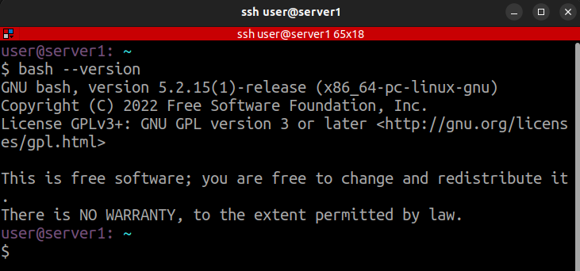
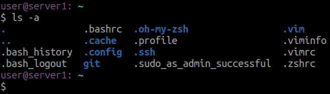
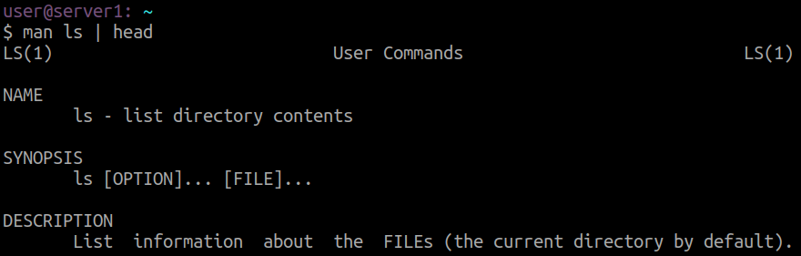
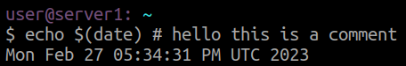

# Basics of Bash

Bash does 2 things:

* Executes programs
* Performs Interactive Sessions

After invoking a shell session, you will be presented with a `$` which is a prompt that waits for user input. From here you can write your commands, and after hitting `[ENTER]` bash will parse your commands and execute them.

In the above example `ls` is the command, and bash parsed the token `-a` as an argument for the command.

You can generally find what a command does by it's `man`ual page.

`#` is the comment symbol for bash, so anything written after that will not be parsed.

